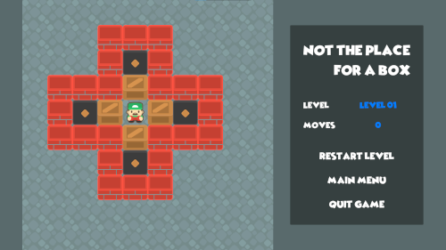
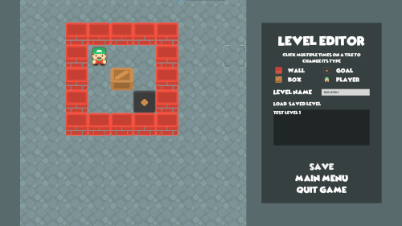

# Not the place for a box

"Not the place for a box" es el nombre de mi prototipo para la tercera Práctica de Evaluación Continua (PEC1) de la asignatura Modding y creación de niveles del Máster Universitario en Diseño y Programación de Videojuegos de la UOC.

El objetivo de la práctica era crear un clon del clásico Sokoban utilizando los conocimientos adquiridos en las prácticas anteriores y realizando investigación por cuenta propia. Además del juego, también había que desarrollar un editor de niveles que permitiera crear y editar niveles para el juego.

## Vídeos

### Vídeo explicativo del editor de niveles

### Vídeo demostrativo de los niveles

## Versión jugable

["Not the place for a box" by Ragart on itch.io](https://ragart.itch.io/not-the-place-for-a-box)

## Versión de Unity

La versión de Unity utilizada para el desarrollo de la práctica es la 2021.3.24f1 LTS.

El orden de las escenas está definido en los builds settings del proyecto, siendo `Assets/Scenes/Opening.scene` la primera escena que debe cargarse.

## Cómo jugar

El objetivo del juego es mover todas las cajas a las zonas de destino. Para ello, el jugador puede moverse por el nivel y empujar las cajas. El jugador no puede empujar más de una caja a la vez, ni empujar una caja contra otra caja o contra una pared.

El jugador puede moverse con las teclas de dirección o con las teclas WASD.

Si el jugador se queda sin movimientos, puede reiniciar con la opción `Restart level` del menú derecho.

## Cómo crear niveles

Para crear niveles, hay que abrir el editor de niveles desde el menú principal del juego. Una vez abierto el editor, se puede crear un nuevo nivel o editar un nivel existente.

En el editor, el jugador dispone de un grid de 10x10 casillas en el que puede colocar los elementos del nivel. Los elementos disponibles son:

- **Pared**: impide el paso del jugador y de las cajas.
- **Caja**: puede ser empujada por el jugador.
- **Zona de destino**: indica la posición en la que deben colocarse las cajas para completar el nivel.
- **Jugador**: el punto de partida del jugador.

Para colocar un elemento, hay que hacer clic múltiples veces sobre la casilla en la que se quiere colocar. Cada clic cambia el elemento de la casilla en el siguiente orden: vacío, pared, caja, zona de destino, jugador.

Una vez colocados todos los elementos, hay que guardar el nivel. Para ello, hay que hacer clic en el botón `Save` del menú lateral. Una vez guardado, el nivel puede ser jugado desde la opción `Load level` del menú principal y puede ser reeditado mediante la opción `Load` del editor.

A efectos de reutilización, el nivel queda guardado en formato JSON en la ubicación en la que la plataforma guarda los datos persistentes. En Windows, la ruta por defecto es `%userprofile%\AppData\LocalLow\Salvador Banderas Rovira\uoc-b2.509-pec3\levels`.

## Créditos

### Paquetes completos

- "Sokoban" - Kenney - https://www.kenney.nl/assets/sokoban

### Fuentes

- "Christopher Hand" - El Stinger - https://www.dafont.com/es/christopherhand.font
- "Wicked Mouse" - Sharkshock - https://www.dafont.com/es/wicked-mouse.font

### Música

- "Caketown - Cute/playful" - Matthew Pablo - https://opengameart.org/content/caketown-cuteplayful
- "Grassy World Overture (8bit/Orchestral)" - Matthew Pablo - https://opengameart.org/content/grassy-world-overture-8bitorchestral
- "Loop: Anticipation" - yd - https://opengameart.org/content/loop-anticipation

## Referencias

### Sokoban

- "Sokoban" - Rodolfo Valeiras [Heureka!] - http://www.rodoval.com/heureka/sokoban/sokoban.html

### 2D - General

- "How to stop diagonal movement - Unity 2d?" - Harry Tong [StackOverflow] - https://stackoverflow.com/questions/46521943/how-to-stop-diagonal-movement-unity-2d
- "unity 2d player movement: disable diagonal & prioritize direction of last key pressed" - ninetailfox [StackOverflow] - https://stackoverflow.com/questions/66520987/unity-2d-player-movement-disable-diagonal-prioritize-direction-of-last-key-pr

### JSON / Serialization

- "Multidimensional array to JSON" - BulbasaurLvl5 [Unity Forums] - https://forum.unity.com/threads/multidimensional-array-to-json.1062872/
- "Serialize and Deserialize Json and Json Array in Unity" - dil33pm [StackOverflow] - https://stackoverflow.com/questions/36239705/serialize-and-deserialize-json-and-json-array-in-unity
- "Serialize C# Properties (how-to with code)" - arkano22 [Unity Forums] - https://forum.unity.com/threads/serialize-c-properties-how-to-with-code.506027/

### New Input System

- "Mouse Position and World Space" - Bill_Martini [Unity Forums] - https://forum.unity.com/threads/mouse-position-and-world-space.440672/
- "Mouse Position with New Input System" - gsbenton027 [Unity Forums] - https://forum.unity.com/threads/mouse-position-with-new-input-system.829248/

### Scene Management

- "Using a multi-scene workflow in Unity/C#" - Mina Pêcheux [Medium] - https://medium.com/c-sharp-progarmming/using-a-multi-scene-workflow-in-unity-c-2ae9a6dc6096

### Tilemaps

- "2D Multi-Layer Tilemap Design in Unity" - u/chuteapps [Reddit] - https://www.reddit.com/r/roguelikedev/comments/at4d91/2d_multilayer_tilemap_design_in_unity/
- "Getting cell by world position when tilemap's anchor is different" - Masea1 [Unity Forums] - https://forum.unity.com/threads/getting-cell-by-world-position-when-tilemaps-anchor-is-different.1222200/
- "is it possible to limit the size of a tilemap grid?" - bossnud [Unity Forums] - https://forum.unity.com/threads/is-it-possible-to-limit-the-size-of-a-tilemap-grid.529584/
- "Tilemap border size" - MatthewRowe [Unity Answers] - https://answers.unity.com/questions/1712075/tilemap-border-size.html
- "Tilemap tile positions assistance" - M0RD3CA1 [Unity Forums] - https://forum.unity.com/threads/tilemap-tile-positions-assistance.485867/
- "Unity 2D Tile-Based 'Sokoban' Game" - Juwal Bose [Envato Tuts+] - https://tutsplus.com/?_ga=2.76559957.1750984611.1684022852-533346742.1681676084
- "Unity: Highlight Tile in Tilemap on Mouseover" - Lukas Hermann [Entrada de blog] - https://lukashermann.dev/writing/unity-highlight-tile-in-tilemap-on-mousever/
- "Unity - How to check if there is a Tile of an specific Tilemap in the position x,y,z" - user10259356 [StackOverflow] - https://stackoverflow.com/questions/51966194/unity-how-to-check-if-there-is-a-tile-of-an-specific-tilemap-in-the-position-x
- "Unity tilemap WorldToCell returns floored world position" - Evg [StackExchange] - https://gamedev.stackexchange.com/questions/201010/unity-tilemap-worldtocell-returns-floored-world-position
- 